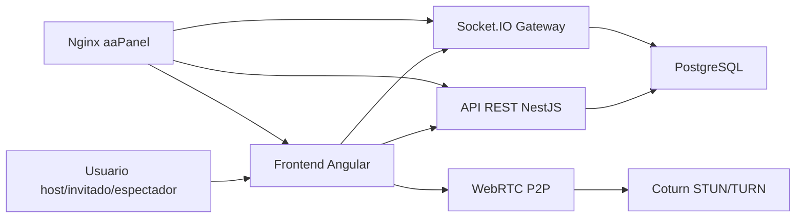
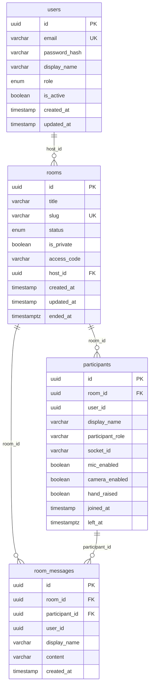
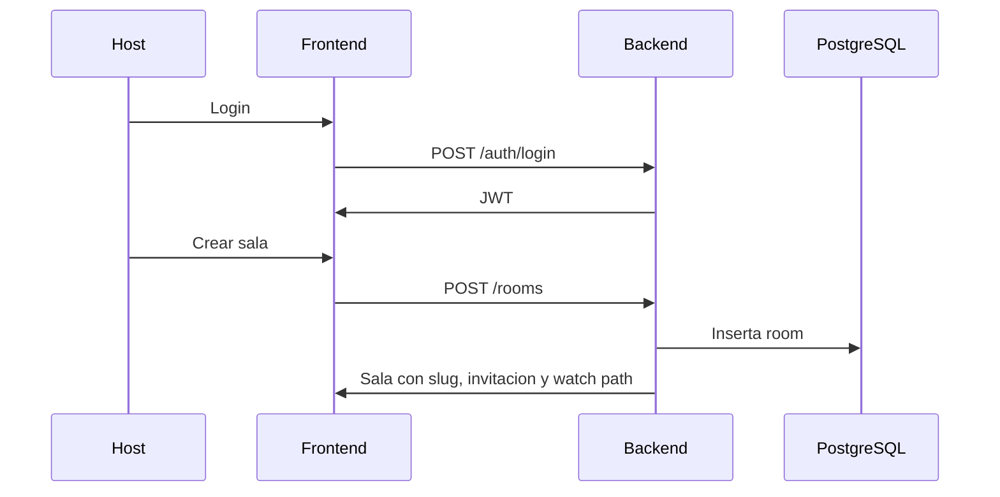
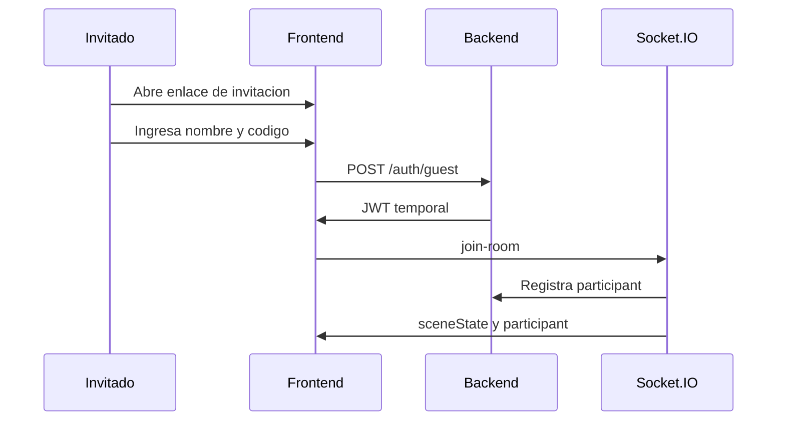
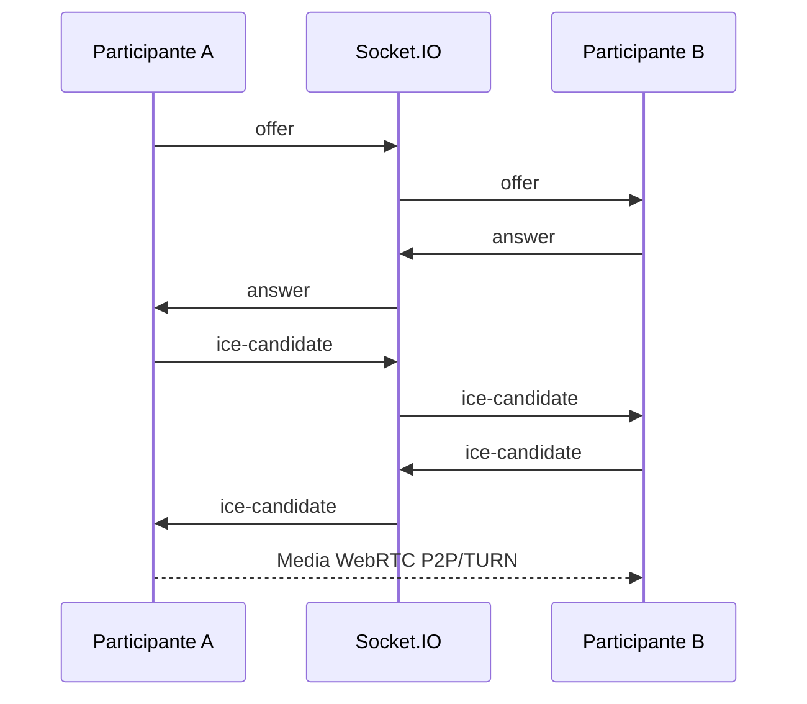
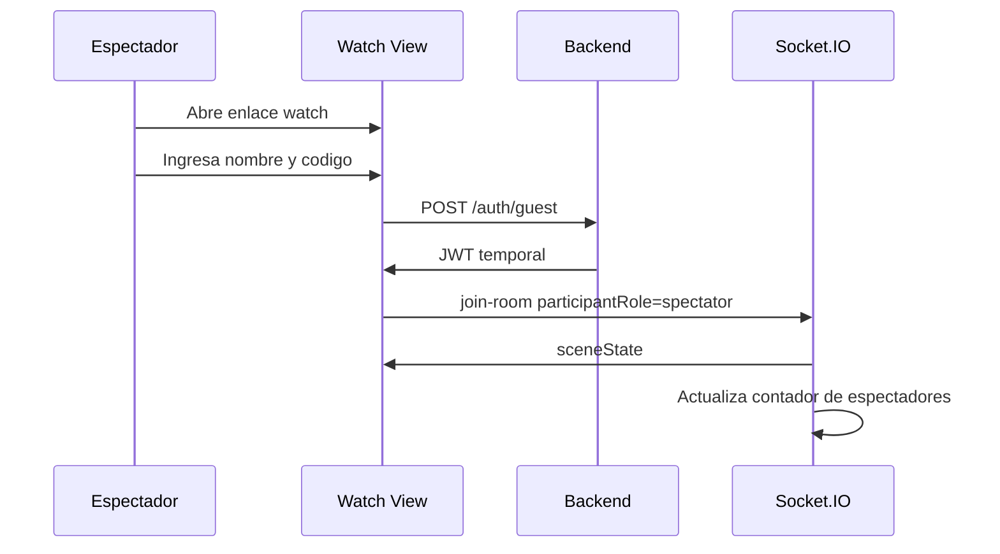

# Documento de Requerimientos y Documentacion del Sistema

## Proyecto

**LIVE STREAM CONFERENCE PLATFORM**

Plataforma web de videoconferencias, reuniones interactivas y transmisiones en vivo, desarrollada con Angular, NestJS, PostgreSQL, Socket.IO y WebRTC.

## 1. Introduccion

### 1.1 Descripcion general

El sistema permite crear salas virtuales de videoconferencia y transmision en vivo similares a una experiencia tipo StreamYard. Un usuario host puede iniciar sesion, crear una sala, invitar participantes mediante un enlace con codigo de acceso, administrar camara y microfono, destacar participantes, controlar la escena de transmision, mostrar banners y transmitir video de YouTube dentro del escenario.

La plataforma separa tres experiencias principales:

- **Administracion y dashboard:** gestion de salas, usuarios y accesos.
- **Sala de conferencia:** espacio privado para host e invitados con audio/video WebRTC.
- **Vista de transmision:** pantalla limpia para espectadores, sin controles de administracion ni envio de audio/video.

El sistema esta preparado para despliegue en Ubuntu Server con aaPanel, Nginx, PostgreSQL y Coturn.

### 1.2 Problema que resuelve

Muchas instituciones necesitan emitir programas, clases, entrevistas o reuniones en vivo sin depender de herramientas externas cerradas. Esta plataforma ofrece una base propia para administrar salas, participantes, espectadores, escena visual, textos en pantalla y comunicacion en tiempo real.

### 1.3 Alcance actual

El alcance actual cubre un MVP funcional avanzado:

- Autenticacion JWT.
- CRUD administrativo de usuarios.
- Creacion, listado y finalizacion de salas.
- Enlaces de invitacion y vista publica de transmision.
- Codigo de acceso para invitados y espectadores.
- WebRTC entre participantes.
- Socket.IO como servidor de signaling y sincronizacion.
- Chat en tiempo real por sala.
- Controles de host sobre invitados.
- Escenas profesionales con layouts, destacado, fondo, banner y video de YouTube.
- Separacion entre participantes y espectadores.
- Preparacion para despliegue con migraciones TypeORM.

### 1.4 Fuera de alcance de la primera etapa

- RTMP nativo hacia YouTube/Facebook.
- Grabacion persistente en servidor.
- Transcodificacion con FFmpeg.
- Moderacion avanzada por cola de espera.
- Persistencia historica completa de escenas.
- Analiticas avanzadas.

## 2. Objetivos

### 2.1 Objetivo general

Desarrollar una plataforma web responsive para videoconferencias y transmisiones en vivo, utilizando WebRTC para audio/video en tiempo real y Socket.IO para signaling, chat y sincronizacion de escena.

### 2.2 Objetivos especificos

- Implementar autenticacion segura con JWT.
- Permitir registro e inicio de sesion de usuarios host.
- Permitir administracion de usuarios y roles por parte de un administrador.
- Crear salas virtuales asociadas al host autenticado.
- Generar URLs unicas de invitacion y visualizacion.
- Proteger el acceso a salas mediante codigo.
- Permitir ingreso de invitados temporales sin registrarlos como usuarios permanentes.
- Gestionar participantes conectados en tiempo real.
- Implementar audio/video entre participantes con WebRTC.
- Implementar signaling con Socket.IO.
- Permitir chat en tiempo real por sala.
- Permitir control de microfono, camara, levantar mano y expulsion.
- Separar espectadores de participantes para que los espectadores no transmitan audio/video.
- Implementar layouts de transmision y destacado de participantes.
- Sincronizar escena, fondo, banner y video entre host, invitados y espectadores.
- Preparar el sistema para despliegue con Nginx, PostgreSQL y Coturn.

## 3. Tecnologias

### 3.1 Frontend

| Tecnologia | Uso |
| --- | --- |
| Angular 21 | Aplicacion web SPA |
| TypeScript | Tipado estatico |
| RxJS | Flujos reactivos y eventos |
| SCSS | Estilos responsive |
| Socket.IO Client | Comunicacion realtime con backend |
| WebRTC API | Audio/video peer-to-peer |
| MediaDevices API | Camara, microfono y base para captura de pantalla |
| YouTube IFrame API | Reproduccion y control de videos de YouTube en escena |

### 3.2 Backend

| Tecnologia | Uso |
| --- | --- |
| NestJS | API REST, modulos y arquitectura backend |
| TypeScript | Tipado estatico |
| TypeORM | ORM y migraciones |
| PostgreSQL | Persistencia relacional |
| Socket.IO | Gateway WebSocket y signaling |
| JWT | Autenticacion |
| Passport JWT | Estrategia de autenticacion |
| bcryptjs | Hash de contrasenas |
| class-validator | Validacion de DTOs |
| Zod | Validacion de variables de entorno |

### 3.3 Infraestructura

| Componente | Uso |
| --- | --- |
| aaPanel | Administracion del servidor |
| Ubuntu Server | Sistema operativo recomendado |
| Nginx | Reverse proxy, SSL y sitios web |
| PostgreSQL | Base de datos |
| Coturn | Servidor STUN/TURN para WebRTC |
| Docker Compose | PostgreSQL local de desarrollo |
| TypeORM migrations | Control versionado del esquema |

### 3.4 Dominios de produccion

| Dominio | Proposito |
| --- | --- |
| `live.limiteflix.com` | Frontend Angular |
| `liveapi.limiteflix.com` | Backend NestJS y Socket.IO |
| `liveturn.limiteflix.com` | Coturn STUN/TURN |

## 4. Arquitectura general

### 4.1 Vista de componentes



### 4.2 Frontend Angular

Responsabilidades:

- Renderizar login, dashboard, administracion de usuarios, sala de conferencia y vista de transmision.
- Capturar camara, microfono y pantalla del usuario.
- Gestionar conexiones WebRTC entre participantes.
- Conectarse al Gateway Socket.IO.
- Mostrar layouts de transmision.
- Mostrar banners, fondos, textos y videos de YouTube.
- Consumir API REST para auth, salas, participantes, chat y usuarios.

### 4.3 Backend NestJS

Responsabilidades:

- Exponer API REST.
- Validar datos de entrada.
- Emitir y validar JWT.
- Gestionar usuarios, salas, participantes y chat.
- Controlar permisos por rol.
- Actuar como signaling server para WebRTC.
- Sincronizar escena de transmision en tiempo real.
- Persistir datos en PostgreSQL.

### 4.4 PostgreSQL

Responsabilidades:

- Persistir usuarios reales del sistema.
- Persistir salas y estado de sala.
- Persistir participantes conectados a salas.
- Persistir mensajes de chat por sala.
- Mantener relaciones entre host, sala, participantes y mensajes.

### 4.5 WebRTC

Responsabilidades:

- Transmitir audio/video entre participantes.
- Usar STUN/TURN para resolver conectividad NAT/firewall.
- Usar Socket.IO solo para intercambio de SDP Offer/Answer e ICE candidates.

## 5. Roles y permisos

| Rol | Persistente | Descripcion |
| --- | --- | --- |
| `admin` | Si | Administra usuarios, roles y estado de cuentas. |
| `host` | Si | Crea salas, administra transmisiones y modera participantes. |
| `viewer` | Si | Rol reservado para usuarios visualizadores registrados. |
| `guest` | No | Identidad temporal para invitados o espectadores que ingresan por enlace. |

### 5.1 Invitados temporales

Los invitados no se guardan en la tabla `users`. Al entrar por invitacion, el sistema emite un JWT temporal con:

- `id` UUID temporal.
- `displayName`.
- `role = guest`.

Luego se registra su presencia en la tabla `participants`, asociada a la sala activa. Esto evita llenar la tabla de usuarios con cuentas falsas o temporales.

### 5.2 Espectadores

Un espectador se registra como participante con `participantRole = spectator`, pero:

- No transmite audio.
- No transmite video.
- No aparece como invitado activo en el escenario administrativo.
- Incrementa el contador de espectadores conectados.
- Puede ver la escena sincronizada de transmision.

## 6. Modulos del sistema

### 6.1 Modulo de autenticacion

Funcionalidades:

- Registro de cuenta host.
- Inicio de sesion.
- Login temporal de invitado.
- Perfil del usuario autenticado.
- Hash de contrasena con bcrypt.
- Emision de JWT.
- Proteccion de endpoints con JwtAuthGuard.

Endpoints:

| Metodo | Ruta | Descripcion |
| --- | --- | --- |
| POST | `/auth/register` | Registra un usuario host. |
| POST | `/auth/login` | Inicia sesion con email y contrasena. |
| POST | `/auth/guest` | Genera sesion temporal de invitado. |
| GET | `/auth/me` | Retorna perfil autenticado. |

### 6.2 Modulo de usuarios

Funcionalidades:

- Listar usuarios.
- Crear usuarios.
- Editar email, nombre, rol, contrasena y estado.
- Activar/inactivar.
- Eliminar usuarios.
- Mostrar badges de roles.
- Gestion protegida solo para administradores.

Restricciones:

- No se permite crear usuarios persistentes con rol `guest`.
- Los roles persistentes permitidos son `admin`, `host` y `viewer`.

Endpoints:

| Metodo | Ruta | Descripcion |
| --- | --- | --- |
| POST | `/users` | Crea usuario. |
| GET | `/users` | Lista usuarios. |
| GET | `/users/:id` | Obtiene usuario. |
| PATCH | `/users/:id` | Actualiza usuario. |
| PATCH | `/users/:id/deactivate` | Inactiva usuario. |
| DELETE | `/users/:id` | Elimina usuario. |

### 6.3 Modulo de salas

Funcionalidades:

- Crear sala.
- Listar salas del host.
- Obtener sala por slug.
- Obtener informacion publica por invitacion.
- Finalizar sala.
- Generar slug unico.
- Generar codigo de acceso.
- Generar rutas de invitacion y transmision.

Endpoints:

| Metodo | Ruta | Descripcion |
| --- | --- | --- |
| GET | `/rooms/invite/:slug` | Consulta publica de sala por invitacion. |
| POST | `/rooms` | Crea sala autenticada. |
| GET | `/rooms` | Lista salas del host. |
| GET | `/rooms/:slug` | Obtiene sala protegida. |
| POST | `/rooms/:id/end` | Finaliza sala. |

Campos principales:

| Campo | Tipo | Descripcion |
| --- | --- | --- |
| `id` | UUID | Identificador de sala. |
| `title` | VARCHAR | Titulo visible. |
| `slug` | VARCHAR unico | Identificador para URLs. |
| `status` | ENUM | `active` o `ended`. |
| `is_private` | BOOLEAN | Indica si la sala es privada. |
| `access_code` | VARCHAR(12) | Codigo de acceso. |
| `host_id` | UUID | Usuario host propietario. |
| `created_at` | TIMESTAMP | Fecha de creacion. |
| `updated_at` | TIMESTAMP | Fecha de actualizacion. |
| `ended_at` | TIMESTAMPTZ | Fecha de finalizacion. |

### 6.4 Modulo de participantes

Funcionalidades:

- Registrar entrada a sala.
- Listar participantes activos.
- Actualizar estado de microfono.
- Actualizar estado de camara.
- Levantar/bajar mano.
- Registrar salida.
- Expulsar participante.
- Moderar participante desde host.
- Distinguir participante de espectador.

Endpoints:

| Metodo | Ruta | Descripcion |
| --- | --- | --- |
| POST | `/rooms/:slug/participants/join` | Une usuario o invitado a sala. |
| GET | `/rooms/:slug/participants` | Lista participantes activos. |
| PATCH | `/participants/:id/state` | Actualiza estado propio. |
| POST | `/participants/:id/leave` | Sale de sala. |
| PATCH | `/participants/:id/moderation` | Modera participante. |
| POST | `/participants/:id/kick` | Expulsa participante. |

### 6.5 Modulo WebRTC y Socket.IO

Funcionalidades:

- Signaling SDP Offer/Answer.
- Intercambio de ICE candidates.
- Eventos de conexion y desconexion.
- Sincronizacion de estados de participantes.
- Reconexiones de Socket.IO.
- Uso de STUN/TURN configurable.

Eventos Socket.IO:

| Evento | Direccion | Descripcion |
| --- | --- | --- |
| `join-room` | Cliente -> servidor | Une socket a una sala. |
| `leave-room` | Cliente -> servidor | Sale de sala. |
| `offer` | Cliente -> servidor -> cliente | Envia SDP offer. |
| `answer` | Cliente -> servidor -> cliente | Envia SDP answer. |
| `ice-candidate` | Cliente -> servidor -> cliente | Envia ICE candidate. |
| `toggle-mic` | Cliente -> servidor | Cambia estado de microfono. |
| `toggle-camera` | Cliente -> servidor | Cambia estado de camara. |
| `raise-hand` | Cliente -> servidor | Cambia estado de mano levantada. |
| `moderate-participant` | Host -> servidor | Modera camara/microfono/mano. |
| `kick-participant` | Host -> servidor | Expulsa participante. |
| `participant-connected` | Servidor -> clientes | Notifica nuevo participante. |
| `participant-disconnected` | Servidor -> clientes | Notifica salida. |
| `participant-updated` | Servidor -> clientes | Notifica cambios de estado. |
| `participant-kicked` | Servidor -> cliente | Notifica expulsion. |

### 6.6 Modulo de chat

Funcionalidades:

- Enviar mensajes en tiempo real por sala.
- Mostrar nombre del participante.
- Mantener historial basico mientras la sala esta activa.
- Consultar ultimos 50 mensajes.
- Emitir mensajes a todos los sockets conectados a la sala.

Endpoints y eventos:

| Tipo | Nombre | Descripcion |
| --- | --- | --- |
| GET | `/rooms/:slug/chat/messages` | Obtiene ultimos mensajes. |
| Socket.IO | `chat-message` | Envia y distribuye mensaje. |

### 6.7 Modulo de escena y transmision

Funcionalidades:

- Selector de layout.
- Destacar participante.
- Destacar video de YouTube.
- Fondo por preset, color o imagen.
- Banner inferior configurable.
- Texto en pantalla con CRUD local de plantillas.
- Tamano de banner: pequeno, mediano, grande.
- Estilos de banner: lower third, ticker, headline.
- Sincronizacion de escena por Socket.IO.
- Vista `watch` limpia para espectadores.

Layouts:

| Layout | Descripcion |
| --- | --- |
| `fullscreen` | El elemento destacado ocupa toda la escena 16:9. |
| `mainGuests` | Principal grande e invitados pequenos. |
| `grid` | Distribucion de participantes en cuadricula. |

Estado sincronizado de escena:

| Campo | Descripcion |
| --- | --- |
| `stageLayout` | Layout actual. |
| `mainParticipantId` | Participante o media destacado. |
| `scenePreset` | Preset visual. |
| `sceneBackground` | Color de fondo. |
| `sceneBackgroundImageUrl` | Imagen de fondo. |
| `sceneAccent` | Color de acento. |
| `bannerVisible` | Visibilidad de banner. |
| `bannerText` | Texto mostrado. |
| `bannerStyle` | Tipo de banner. |
| `bannerSize` | Tamano del banner. |
| `bannerBackground` | Color del banner. |
| `bannerTextColor` | Color del texto. |
| `sceneMediaType` | Tipo de media, actualmente `video`. |
| `sceneMediaUrl` | URL de YouTube. |
| `sceneMediaTitle` | Titulo de media. |
| `sceneMediaVisible` | Visibilidad de media. |
| `sceneMediaCommand` | `play`, `pause`, `restart`, `none`. |
| `sceneMediaCommandId` | Identificador para sincronizar comandos. |

### 6.8 Modulo de dashboard

Funcionalidades:

- Mostrar salas en cards profesionales.
- Crear sala.
- Ver estado activa/finalizada.
- Copiar invitacion.
- Copiar enlace de transmision.
- Entrar a conferencia.
- Finalizar sala.

### 6.9 Modulo de vista de transmision

Funcionalidades:

- Acceso por enlace `watch`.
- Autenticacion temporal con nombre y codigo.
- Vista sin menus administrativos.
- Escenario 16:9.
- Contador de espectadores visible para host.
- Sin envio de audio/video desde espectador.
- Sincronizacion de layout, banner, fondo y video.

## 7. Requerimientos funcionales

| Codigo | Requerimiento | Estado |
| --- | --- | --- |
| RF-01 | El sistema debe permitir registro de usuarios host. | Implementado |
| RF-02 | El sistema debe permitir inicio de sesion con JWT. | Implementado |
| RF-03 | El sistema debe permitir login temporal de invitados. | Implementado |
| RF-04 | El sistema debe permitir CRUD de usuarios para administradores. | Implementado |
| RF-05 | El sistema debe permitir roles `admin`, `host`, `viewer` y `guest`. | Implementado |
| RF-06 | El sistema debe impedir guardar invitados como usuarios persistentes. | Implementado |
| RF-07 | El sistema debe permitir crear salas asociadas al host autenticado. | Implementado |
| RF-08 | El sistema debe listar salas del host. | Implementado |
| RF-09 | El sistema debe permitir finalizar salas. | Implementado |
| RF-10 | El sistema debe generar enlaces de invitacion unicos. | Implementado |
| RF-11 | El sistema debe generar enlaces de transmision para espectadores. | Implementado |
| RF-12 | El sistema debe proteger salas con codigo de acceso. | Implementado |
| RF-13 | El sistema debe permitir entrada de invitados por enlace. | Implementado |
| RF-14 | El sistema debe permitir entrada de espectadores por enlace `watch`. | Implementado |
| RF-15 | El sistema debe capturar camara del usuario. | Implementado |
| RF-16 | El sistema debe capturar microfono del usuario. | Implementado |
| RF-17 | El sistema debe permitir apagar y encender microfono propio. | Implementado |
| RF-18 | El sistema debe permitir apagar y encender camara propia. | Implementado |
| RF-19 | El sistema debe transmitir audio/video entre participantes con WebRTC. | Implementado |
| RF-20 | El sistema debe intercambiar SDP Offer/Answer por Socket.IO. | Implementado |
| RF-21 | El sistema debe intercambiar ICE candidates por Socket.IO. | Implementado |
| RF-22 | El sistema debe mostrar participantes conectados. | Implementado |
| RF-23 | El sistema debe permitir silenciar participante desde host. | Implementado |
| RF-24 | El sistema debe permitir bloquear camara de participante desde host. | Implementado |
| RF-25 | El sistema debe permitir expulsar participante desde host. | Implementado |
| RF-26 | El sistema debe permitir levantar mano. | Implementado |
| RF-27 | El sistema debe permitir chat en tiempo real por sala. | Implementado |
| RF-28 | El sistema debe mostrar nombre del participante en mensajes. | Implementado |
| RF-29 | El sistema debe mantener historial reciente de chat. | Implementado |
| RF-30 | El sistema debe permitir seleccionar layout de transmision. | Implementado |
| RF-31 | El sistema debe permitir destacar cualquier participante. | Implementado |
| RF-32 | El sistema debe permitir personalizar fondo por color o imagen. | Implementado |
| RF-33 | El sistema debe permitir mostrar banner inferior. | Implementado |
| RF-34 | El sistema debe permitir tamano de banner pequeno/mediano/grande. | Implementado |
| RF-35 | El sistema debe permitir guardar plantillas locales de texto. | Implementado |
| RF-36 | El sistema debe reproducir video de YouTube en escena. | Implementado |
| RF-37 | El sistema debe controlar play, pause y restart de YouTube desde host. | Implementado |
| RF-38 | El sistema debe sincronizar escena por Socket.IO. | Implementado |
| RF-39 | El sistema debe mostrar contador de espectadores conectados. | Implementado |
| RF-40 | El sistema debe proveer vista de transmision sin menus. | Implementado |
| RF-41 | El sistema debe ser responsive para desktop y mobile. | Implementado |
| RF-42 | El sistema debe usar migraciones para despliegue. | Implementado |
| RF-43 | El sistema debe permitir compartir pantalla. | Parcial, base preparada |
| RF-44 | El sistema debe permitir grabacion de transmision. | Pendiente |
| RF-45 | El sistema debe permitir RTMP hacia redes sociales. | Pendiente |

## 8. Requerimientos no funcionales

| Codigo | Requerimiento | Descripcion |
| --- | --- | --- |
| RNF-01 | Seguridad | Autenticacion JWT, hash de contrasena y validacion de DTOs. |
| RNF-02 | HTTPS | En produccion debe operar bajo HTTPS con Nginx/aaPanel. |
| RNF-03 | CORS controlado | Backend solo debe permitir origenes configurados. |
| RNF-04 | Baja latencia | Audio/video debe usar WebRTC P2P cuando sea posible. |
| RNF-05 | NAT traversal | Debe usar STUN/TURN para usuarios fuera de la misma red. |
| RNF-06 | Escalabilidad inicial | Backend separado de frontend y base de datos. |
| RNF-07 | Mantenibilidad | Arquitectura modular en NestJS y servicios Angular. |
| RNF-08 | Despliegue controlado | Base de datos con migraciones, no `synchronize` en produccion. |
| RNF-09 | Responsive | Interfaz usable en desktop y mobile. |
| RNF-10 | Compatibilidad | Navegadores modernos: Chrome, Edge, Firefox, Safari movil con HTTPS. |
| RNF-11 | Observabilidad basica | Health endpoint y logs de NestJS. |
| RNF-12 | Persistencia | Usuarios, salas, participantes y chat se guardan en PostgreSQL. |
| RNF-13 | Configuracion externa | Variables de entorno backend y archivo runtime frontend. |
| RNF-14 | Privacidad | Espectadores no transmiten audio/video. |
| RNF-15 | Integridad | Relaciones de base de datos entre salas, usuarios, participantes y mensajes. |

## 9. Base de datos

### 9.1 Modelo entidad-relacion



### 9.2 Tabla `users`

Almacena usuarios permanentes del sistema.

| Campo | Tipo | Restricciones | Descripcion |
| --- | --- | --- | --- |
| `id` | UUID | PK | Identificador. |
| `email` | VARCHAR | UNIQUE, NOT NULL | Email de acceso. |
| `password_hash` | VARCHAR | NOT NULL | Contrasena hasheada. |
| `display_name` | VARCHAR | NOT NULL | Nombre visible. |
| `role` | ENUM | NOT NULL | `admin`, `host`, `guest`, `viewer`. |
| `is_active` | BOOLEAN | DEFAULT true | Estado de cuenta. |
| `created_at` | TIMESTAMP | DEFAULT now | Creacion. |
| `updated_at` | TIMESTAMP | DEFAULT now | Actualizacion. |

Nota: aunque el enum contiene `guest`, la logica del sistema bloquea persistir usuarios con ese rol.

### 9.3 Tabla `rooms`

Almacena salas creadas por hosts.

| Campo | Tipo | Restricciones | Descripcion |
| --- | --- | --- | --- |
| `id` | UUID | PK | Identificador. |
| `title` | VARCHAR | NOT NULL | Titulo. |
| `slug` | VARCHAR | UNIQUE, NOT NULL | URL amigable. |
| `status` | ENUM | DEFAULT active | Estado. |
| `is_private` | BOOLEAN | DEFAULT false | Privacidad. |
| `access_code` | VARCHAR(12) | NOT NULL | Codigo de ingreso. |
| `host_id` | UUID | FK users.id | Host propietario. |
| `created_at` | TIMESTAMP | DEFAULT now | Creacion. |
| `updated_at` | TIMESTAMP | DEFAULT now | Actualizacion. |
| `ended_at` | TIMESTAMPTZ | NULL | Finalizacion. |

Relaciones:

- `rooms.host_id -> users.id`.
- Una sala pertenece a un host.
- Una sala puede tener muchos participantes y mensajes.

### 9.4 Tabla `participants`

Registra presencia en sala. Puede representar usuarios reales o invitados temporales.

| Campo | Tipo | Restricciones | Descripcion |
| --- | --- | --- | --- |
| `id` | UUID | PK | Identificador de participacion. |
| `room_id` | UUID | FK rooms.id | Sala asociada. |
| `user_id` | UUID | NOT NULL | Usuario real o UUID temporal. |
| `display_name` | VARCHAR | NOT NULL | Nombre visible. |
| `participant_role` | VARCHAR | DEFAULT participant | `participant` o `spectator`. |
| `socket_id` | VARCHAR | NULL | Socket.IO actual. |
| `mic_enabled` | BOOLEAN | DEFAULT true | Estado microfono. |
| `camera_enabled` | BOOLEAN | DEFAULT true | Estado camara. |
| `hand_raised` | BOOLEAN | DEFAULT false | Mano levantada. |
| `joined_at` | TIMESTAMP | DEFAULT now | Ingreso. |
| `left_at` | TIMESTAMPTZ | NULL | Salida. |

Relacion importante:

- `participants.room_id -> rooms.id`.
- `participants.user_id` no tiene FK a `users` para permitir invitados temporales.

### 9.5 Tabla `room_messages`

Almacena mensajes de chat.

| Campo | Tipo | Restricciones | Descripcion |
| --- | --- | --- | --- |
| `id` | UUID | PK | Identificador. |
| `room_id` | UUID | FK rooms.id | Sala. |
| `participant_id` | UUID | FK participants.id | Participante que envio. |
| `user_id` | UUID | NOT NULL | Usuario real o temporal. |
| `display_name` | VARCHAR | NOT NULL | Nombre al enviar. |
| `content` | VARCHAR(500) | NOT NULL | Mensaje. |
| `created_at` | TIMESTAMP | DEFAULT now | Fecha. |

Relaciones:

- `room_messages.room_id -> rooms.id`.
- `room_messages.participant_id -> participants.id`.
- `room_messages.user_id` no tiene FK a `users` por compatibilidad con invitados temporales.

### 9.6 Migraciones

El sistema usa TypeORM migrations. En produccion debe estar:

```env
DATABASE_SYNCHRONIZE=false
```

Comandos:

```bash
npm run migration:show
npm run migration:run
npm run migration:revert
```

En produccion, despues de compilar:

```bash
npm run build
npm run migration:run:prod
npm run start:prod
```

Migracion inicial:

- `1780881200000-InitialSchema.ts`.

## 10. Seguridad

### 10.1 Autenticacion

- JWT firmado con `JWT_SECRET`.
- Expiracion configurable con `JWT_EXPIRES_IN`.
- Guard JWT en endpoints protegidos.
- Socket.IO valida token al conectarse.

### 10.2 Contrasenas

- Hash con bcrypt.
- Nunca se expone `password_hash` en respuestas.

### 10.3 Autorizacion

- Roles para endpoints administrativos.
- Administracion de usuarios protegida por `admin`.
- Salas asociadas al host autenticado.
- Moderacion limitada al host de la sala.

### 10.4 Acceso a salas

- Invitados y espectadores requieren codigo de acceso.
- Host puede entrar a su sala sin codigo.
- Salas finalizadas bloquean ingreso.

### 10.5 CORS

Origenes configurables:

```env
FRONTEND_URL=https://live.limiteflix.com
FRONTEND_URLS=https://live.limiteflix.com
```

En produccion no se aceptan origenes LAN automaticamente.

## 11. Infraestructura y despliegue

### 11.1 Servicios

| Servicio | Dominio/Puerto | Descripcion |
| --- | --- | --- |
| Frontend Angular | `https://live.limiteflix.com` | SPA servida por Nginx. |
| Backend NestJS | `127.0.0.1:3000` interno | API REST y Socket.IO. |
| API publica | `https://liveapi.limiteflix.com` | Reverse proxy Nginx. |
| PostgreSQL | `127.0.0.1:5432` | Base de datos. |
| Coturn | `liveturn.limiteflix.com:3478/5349` | STUN/TURN. |

### 11.2 Variables backend de produccion

Archivo base:

- `backend/.env.production.example`

Valores principales:

```env
NODE_ENV=production
HOST=127.0.0.1
PORT=3000
FRONTEND_URL=https://live.limiteflix.com
FRONTEND_URLS=https://live.limiteflix.com
HTTPS_ENABLED=false
DATABASE_SYNCHRONIZE=false
JWT_SECRET=CAMBIAR_POR_SECRETO_LARGO
```

### 11.3 Configuracion frontend runtime

Archivo:

- `frontend/public/weblive-config.js`

En el build final:

- `frontend/dist/frontend/browser/weblive-config.js`

Valores:

```js
window.__WEBLIVE_CONFIG__ = {
  apiBaseUrl: 'https://liveapi.limiteflix.com',
  socketBaseUrl: 'https://liveapi.limiteflix.com',
  turnUrl: 'turns:liveturn.limiteflix.com:5349',
  turnUsername: 'weblive',
  turnCredential: 'CHANGE_ME_TURN_PASSWORD',
};
```

### 11.4 Nginx aaPanel

Plantillas incluidas:

- `docs/aapanel-live.limiteflix.com.nginx.conf`.
- `docs/aapanel-liveapi.limiteflix.com.nginx.conf`.

Requisitos:

- SSL activo para `live.limiteflix.com`.
- SSL activo para `liveapi.limiteflix.com`.
- Proxy WebSocket para `/socket.io/`.

### 11.5 Coturn

Plantilla:

- `docs/liveturn.limiteflix.com.turnserver.conf`.

Puertos requeridos:

```txt
3478/tcp
3478/udp
5349/tcp
5349/udp
49152-65535/udp
```

## 12. Interfaces principales

### 12.1 Login y registro

- Login.
- Registro de host.
- Mensajes de error.
- Persistencia de JWT.

### 12.2 Dashboard

- Cards de salas.
- Estado activa/finalizada.
- Copiar invitacion.
- Copiar transmision.
- Entrar.
- Finalizar.

### 12.3 Administracion de usuarios

- Tabla de usuarios.
- Badges de roles.
- Estado activo/inactivo.
- Formulario compacto.
- Crear, editar, inactivar, eliminar.

### 12.4 Sala de conferencia

- Video local.
- Videos remotos.
- Controles de microfono/camara.
- Levantar mano.
- Chat.
- Lista de participantes.
- Controles de host.
- Panel de escena.

### 12.5 Vista de transmision

- Escenario 16:9.
- Sin botones administrativos.
- Sin audio/video desde espectador.
- Fullscreen.
- Reproduccion sincronizada de video de YouTube.

## 13. Flujos principales

### 13.1 Flujo host crea sala



### 13.2 Flujo invitado entra a sala



### 13.3 Flujo WebRTC



### 13.4 Flujo espectador



## 14. Criterios de aceptacion

- Un host puede registrarse e iniciar sesion.
- Un admin puede gestionar usuarios.
- Un host puede crear una sala activa.
- El dashboard muestra salas y acciones rapidas.
- El sistema genera enlace de invitacion y watch.
- Un invitado entra con nombre y codigo sin crear usuario persistente.
- Dos participantes pueden verse y escucharse por WebRTC.
- El host puede apagar microfono/camara de un invitado.
- El host puede expulsar a un invitado.
- El chat envia mensajes en tiempo real.
- La escena se sincroniza entre participantes y espectadores.
- El video de YouTube se puede destacar y controlar desde el host.
- Los espectadores no transmiten audio/video.
- El contador de espectadores se actualiza.
- El sistema compila frontend y backend.
- El backend usa migraciones y no `synchronize` en produccion.

## 15. Riesgos y consideraciones

| Riesgo | Mitigacion |
| --- | --- |
| Usuarios detras de NAT/firewall no conectan WebRTC | Usar Coturn con puertos UDP abiertos. |
| CORS bloquea frontend | Configurar `FRONTEND_URL` y `FRONTEND_URLS`. |
| Socket.IO no conecta detras de Nginx | Configurar proxy para `/socket.io/` con Upgrade headers. |
| Cambios de BD rompen produccion | Usar migraciones TypeORM. |
| Credenciales expuestas | Usar `.env` seguro y no versionar secretos. |
| Video no reproduce automaticamente en mobile | Requerir interaccion del usuario por politicas del navegador. |
| Escena no persiste tras reinicio backend | Persistencia de escena queda como mejora futura. |

## 16. Estado del proyecto

### Implementado

- Backend NestJS modular.
- Frontend Angular responsive.
- PostgreSQL con TypeORM.
- Migraciones iniciales.
- Auth JWT.
- Usuarios y roles.
- Salas.
- Invitaciones.
- Codigo de acceso.
- Participantes e invitados temporales.
- Espectadores.
- Socket.IO Gateway.
- WebRTC entre participantes.
- Chat realtime.
- Moderacion basica.
- Dashboard.
- Administracion de usuarios.
- Escena profesional sincronizada.
- Video de YouTube en escena.
- Configuracion para aaPanel.

### Pendiente recomendado

- Persistir configuracion de escena en base de datos.
- Implementar grabacion local o en servidor.
- Implementar RTMP hacia YouTube/Facebook.
- Mejorar analiticas de espectadores.
- Agregar pruebas e2e.
- Agregar monitoreo de salud y logs persistentes.
- Automatizar deploy con script o CI/CD.

## 17. Conclusiones

La plataforma LIVE STREAM CONFERENCE PLATFORM ya cuenta con una base funcional para reuniones y transmisiones en vivo. El sistema combina WebRTC para baja latencia, Socket.IO para eventos en tiempo real, NestJS para API y signaling, PostgreSQL para persistencia y Angular para una interfaz responsive.

La arquitectura modular permite crecer hacia funcionalidades profesionales como RTMP, grabacion, persistencia de escenas, moderacion avanzada y analiticas. La preparacion con migraciones, dominios separados y documentacion de aaPanel permite avanzar hacia un despliegue real en produccion.
